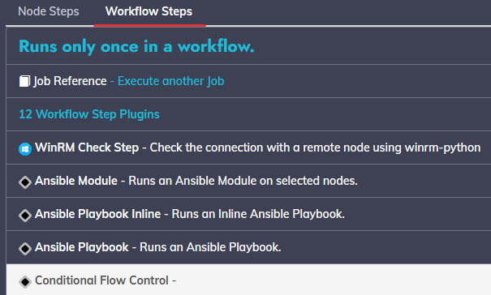
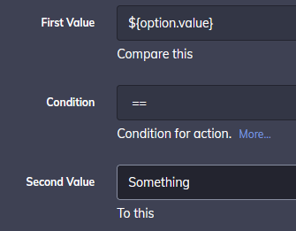
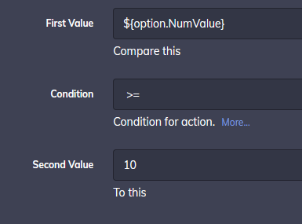

# Flow Control Plugin

A Rundeck plugin to control execution flow with conditions.

### Install

Download last release or download source and build :

```
./gradlew clean build
```

Put jar file in your ```$RDECK_BASE/libext/``` directory

### Usage

Select the Conditional Flow control plugin when creating a job.



Configure your condition

With == and != you can use String or Numeric values.



With >=,>,<,<= you need use Numeric values.



If "Halt" is set on "if condition is true" job halt when condition is true.

If "Halt" is set on "if condition is false" job halt when condition is false.

Case for "Halt Status" :
- "Success" : Job halt with successed.
- "Failed" : Job halt with failed.
- "Custom Status" : Use "Custom Status" parameter as status.

"Custom Status" : Use this status if halt and "Halt Status" is set on "Custom Status".

If "Halt Status" is set on "Custom Status" and this parameter is empty halt going on failed status.

If "Halt Message" is not empty, then if it halt, print this message.


