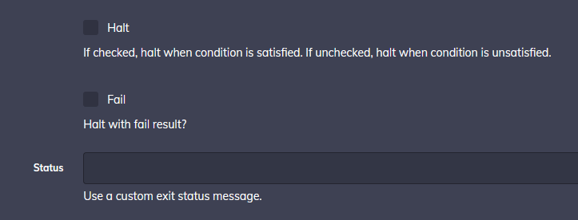

# Flow Control Plugin

A Rundeck plugin that adds conditional control flow.

### Usage

Select the Conditional Flow control plugin when creating a job.

Configure your condition

With == and != you can use String or Numeric values.

With >=,>,<,<= you need use Numeric values.

If "Halt" is checked, halt when condition is satisfied. If unchecked, halt when condition is unsatisfied.
If "Fail" is checked, then if it halts, it does so with failed status.
If "Status" is not empty, then if it halts, it does so with this custom status.

If "Halt Message" is not empty, then if it halts, it prints this message.

